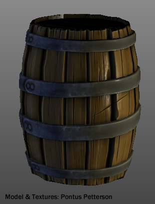

shaders
=======

Shaders for various 3D-applications.

## maya_phong.cgfx

This is a Maya CGFX viewport shader. Currently it implements the Phong-Lambert shading model.

### How to use

Load the `cgfxShader.mll` plugin in Maya. Assign the object a new cgfxShader and point the CgFX File field to `maya_pong.cgfx`.

Tune the specular exponent, create a locator and assign its name to the Light Position attribute. You can also assign a diffuse texture with the corresponding attribute. Procedural textures will not work.