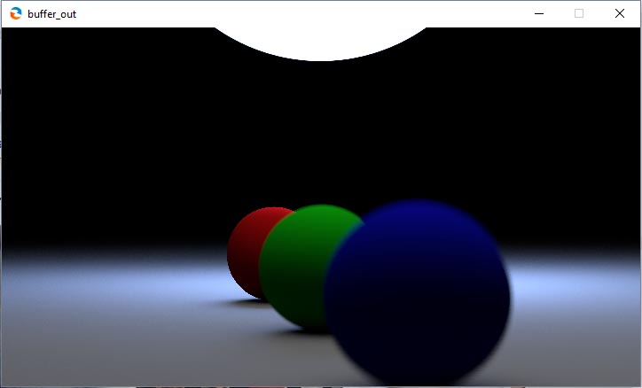

# Shadron shaders

Shaders written for the program Shadron.

Many of the shaders have analogues in the `glsl` folder. Those generally 
showcase the functionality for the given file in the GLSL-folder.

## Noteworthy shaders (in order of "cool")

### tracer1.shadron

A work-in-progress path tracer. Currently does depth of field and diffuse spheres only.

Progressively updates as you run it. The sample count is stored in the alpha channel and another
feedback buffer appends them. The final image is the aggregate RBG values divided by the sample count.

The update rate is set to 3 Hz, your GPU can probably do faster.

*Note:* You need to "refresh" the script after parameter changes, the buffers won't clear by themselves.

Dependencies are `glsl/luminosity.glsl` and `snoise.glsl`.

### crt.shadron

A work-in-progress CRT shader, it does a decent effect but has a long way to go to authenticity.

Dependencies are `glsl/luminosity.glsl` and `glsl/gamma_correct.glsl`.